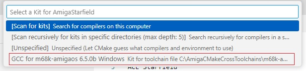
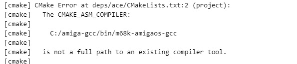

ACE Starfield
----

Assuming you have the ACE helloworld setup already working (see [here](https://github.com/0wen101/vscode-amiga-gcc-ACE-helloworld)), it's fairly straightforward to get other ACE projects working.<br>For example [Starfield](https://github.com/Ozzyboshi/AmigaStarfield) which is configured here with the same VS Code setup as before (no changes to the Starfield code itself).

```
note : ACE projects not using the CMake build system (e.g. GNU Autotools) will require extra configuration to work here
```

The approach is the same - CMake builds compatible Makefiles, VS Code then uses them to compile and build the Amiga exe and finally WinUAE is launched to run the exe.


**instructions**
<br>

1.Make a build subfolder

2.ACE is required of course and is already configured in file '.gitmodules' as a Git submodule.<br>If not there already, make a 'deps/ace' sub folder in your workspace folder. <br>For convenvience I am using Git bash and the commands are :

```
cd /d/Git/AmigaStarfield-ozzyb
mkdir deps
cd deps
mkdir ace
```


Then pull down the correct version (commit 183188e is required to build starfield) : 

```
cd /d/Git/AmigaStarfield-ozzyb
git submodule update --init --recursive
cd deps/ace
git checkout 183188e
```

3.Press Ctrl Shift P again and select **CMAKE: Configure**. Select GCC for m68k if prompted. This will create Bebbo GCC Makefiles.



4.Press **F7** to start building the Amiga binaries from the Makefiles and automatically copy the binary file to the correct WinUAE folder when done

5.Press **F5** to execute the run task. This launches WinUAE with the exe configured to start in the startup-sequence file 

If need to rebuild, delete the contents of the build folder then F7, F5 once again.

**any issues**

At time of writing, Starfield is not working with the latest version of ACE and requires an older version/commit 183188e on branch 'main' (the line 'git checkout 183188e' does that). <br>If using the wrong version of ACE (in the deps/ace) folder, you will see something like:



Likewise, if Starfield is not even compiling (when press F7), again check you are using commit 183188e of ACE in the deps/ace folder.


<br>


